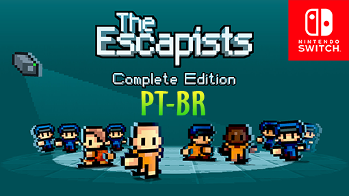

<h1 align="center"><figure>
  
</figure></h1>

## :small_blue_diamond:Sobre a Tradução.

Tradução jogo base feita pelo grupo TriboGamer e DLC (mupynho) 

_ "Portado para Nintendo Switch por Traduções GBJ" _

## :small_blue_diamond:Por quê?

Este projeto irá ajudar muitas pessoas a entender melhor a história do jogo, portanto ficarei feliz se você puder ajudar de alguma forma o projeto, tradução, erros ortográficos e revisão em jogo!

## :small_blue_diamond:Requerimentos

- Nintendo Switch Desbloqueado - SXOS ou ATMOSPHERE>

## :small_blue_diamond:Instalação

**SXOS** Basta colocar a pasta ```01001B700BA7C000``` no caminho ```sxos\titles``` para quem usa esse desbloqueio e reiniciar o desbloqueio.
**ATMOSPHERE** Basta colocar a pasta ```01001B700BA7C000``` no caminho ```Atmosphere\Contents``` para quem usa esse desbloqueio

## :small_blue_diamond:Ferramentas Ultilizadas

:link: [Visual Studio Code](https://code.visualstudio.com)
:link: [Excel 2016](https://www.office.com/?omkt=pt-br)

## :small_blue_diamond:Doações

[](https://picpay.me/gilsongbj)

Obrigado!:wave:
